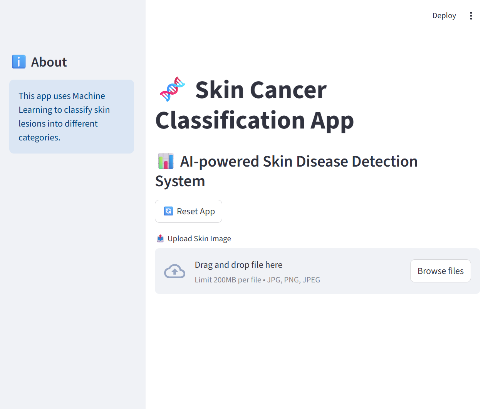
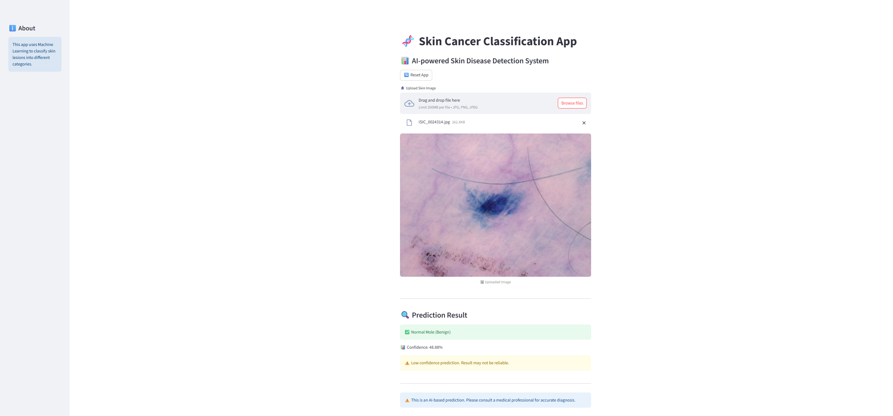
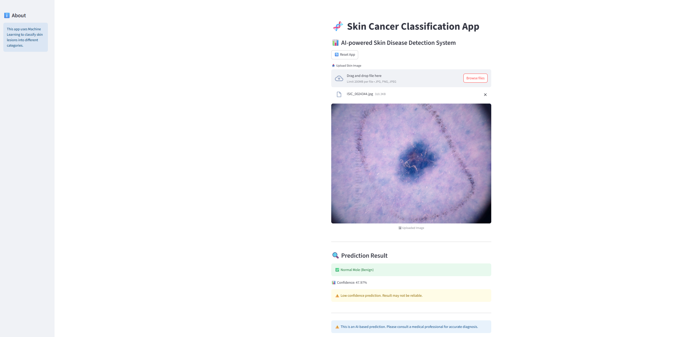

# 🧬 Skin Cancer Classification App

An end-to-end Machine Learning project for classifying skin lesions
using Computer Vision and feature engineering, with an interactive
Streamlit web application.

------------------------------------------------------------------------

## 🚀 Project Overview

This project focuses on detecting and classifying different types of
skin lesions using Machine Learning. It includes preprocessing, feature
extraction, model training, and deployment.

------------------------------------------------------------------------

## 👨‍💻 My Contribution

-   Designed and implemented the complete ML pipeline from scratch
-   Performed data preprocessing and feature engineering (GLCM +
    statistical features)
-   Trained and compared multiple ML models (Random Forest, SVM)
-   Handled large dataset (\~10,000+ images)
-   Built an interactive Streamlit web application
-   Used AI tools for guidance and optimization during development

------------------------------------------------------------------------

## 🎯 Features

-   📸 Image Upload Interface
-   🧠 ML Models (Random Forest, SVM)
-   🔍 Feature Engineering (GLCM)
-   📊 Confidence Score
-   ⚠️ Risk Alert (Melanoma detection)
-   🌐 Streamlit UI

------------------------------------------------------------------------

## 📊 Model Performance

-   Random Forest: \~69%
-   SVM: \~68%

------------------------------------------------------------------------

### 🔹 App Interface

### 🔹 Prediction Result

### 🔹 Another Example

------------------------------------------------------------------------

## 🛠 Tech Stack

Python, OpenCV, NumPy, Pandas, Scikit-learn, Streamlit

------------------------------------------------------------------------

## 📦 Dataset

https://www.kaggle.com/datasets/kmader/skin-cancer-mnist-ham10000/data

------------------------------------------------------------------------

## ▶️ Run the App

pip install -r requirements.txt\
streamlit run app.py

------------------------------------------------------------------------

## 🔗 Connect With Me

-   GitHub: https://github.com/Pritam9952
-   LinkedIn: https://www.linkedin.com/in/pritam-nagar/

------------------------------------------------------------------------

## ⚠️ Disclaimer

This project is for educational purposes only.

------------------------------------------------------------------------

⭐ If you like this project, give it a star!
